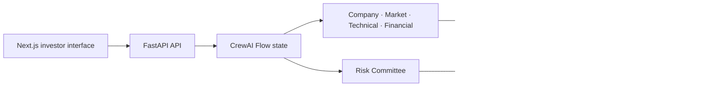
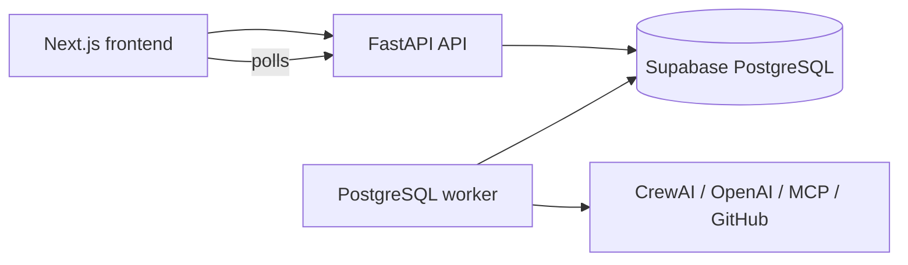

# DealLens AI

**Multi-Agent Startup Due-Diligence & Venture Intelligence Platform.** DealLens structures company, market, technical, financial, and risk signals into an evidence-labelled investment memo. It is decision support, not an investment guarantee.

## Architecture



## Production worker architecture



The API persists a case and queued job, then returns immediately. Run the worker separately with `python -m backend.worker`; it claims one PostgreSQL job atomically and performs the long-running workflow. Report/PDF reads use stored report data and never rerun AI.

CrewAI owns specialist-agent orchestration and bounded flow routing. MCP owns reusable integrations: deterministic finance tools, diligence frameworks as resources, and an investment-committee memo prompt. The flow allows at most one targeted retry before risk synthesis.

## OpenAI configuration

All CrewAI agents use the same cost-efficient model, configured centrally in `backend/config.py`. The API key is read **only** from the backend process environment or local `.env`; it is never included in frontend code or API responses.

```bash
copy .env.example .env
# Edit .env and add OPENAI_API_KEY. Do not commit this file.
```

```dotenv
OPENAI_API_KEY=
OPENAI_MODEL=gpt-4.1-mini
```

If `OPENAI_API_KEY` is missing, `POST /api/cases` returns a clear `503 OPENAI_CONFIGURATION_ERROR`; it does not substitute fake AI output. The dashboard's `/report` is a separately and visibly labelled static demo.

## Agents

- Company Intelligence: public claims, product, team and traction evidence.
- Market & Competition: market, competitors, substitutes and moat signals.
- Technical Due Diligence: public GitHub metadata only.
- Financial Analysis: interprets deterministic MCP metrics.
- Risk Committee: challenges gaps and contradictions.
- Investment Memo: structured decision-support output.

## Finance MCP

The custom server (`backend/mcp/servers/finance_server.py`) provides tools: `calculate_runway`, `calculate_monthly_burn`, `calculate_arpu`, `calculate_revenue_growth`, `calculate_customer_concentration`, and `calculate_basic_unit_economics`.

Resources: `deallens://frameworks/preseed`, `deallens://frameworks/saas-metrics`, and `deallens://risk-policy`. Prompt: `investment_committee_memo`.

## API

- `GET /api/health` — safe configuration status (no secret values)
- `GET /api/mcp/discovery` — server tools, resources and prompts
- `POST /api/cases` — queues a real CrewAI case; requires OpenAI config
- `POST /api/cases/with-pitch-deck` — accepts JSON and a size-limited PDF deck; text is founder-provided evidence
- `GET /api/cases/{case_id}/status` — safe stage/progress metadata only
- `GET /api/cases/{case_id}/report` — real structured result when complete
- `GET /api/cases/{case_id}/memo.pdf` — exported real investment memo
- `GET /api/cases/demo` — explicitly labelled static demo report

## Run locally

Backend (from repository root):

```bash
# CrewAI currently supports Python 3.10–3.13. Use a 3.13 environment.
py -3.13 -m venv .venv
.\.venv\Scripts\Activate.ps1
pip install -r backend/requirements.txt
uvicorn backend.main:app --reload --port 8000
pytest backend/tests -q
```

Frontend:

```bash
cd frontend
npm install
npm run dev
npm run typecheck
npm run build
```

## Evidence, security, and current MVP limits

Evidence is classified as verified, supported, founder-provided, unverified, conflicting, or unavailable. GitHub lookup validates public repository URLs, fetches metadata/activity/contributors/releases when available, uses a TTL cache, and has strict retry/backoff behavior. Public website research is a low-friction optional source; inaccessible sites become unavailable evidence. API keys remain server-side; `.env` is git-ignored. The MVP job runner is in-memory, so active cases do not survive a process restart; replace it with a durable queue/store before deployment.

## Roadmap

Add persistent case storage, approved search MCP connectors, authenticated GitHub rate-limit handling, and a deployment pipeline.
