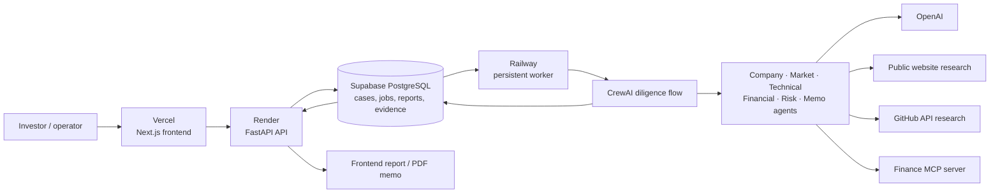

# DealLens AI

## Multi-Agent Startup Due-Diligence & Venture Intelligence Platform

DealLens AI is a multi-agent venture-intelligence platform for early-stage startup due diligence. It researches public company and technical signals, evaluates supplied financial inputs, identifies evidence gaps and risks, and produces an auditable investment memo for decision support.

Built with CrewAI, MCP, OpenAI, FastAPI, Next.js, Supabase PostgreSQL, durable worker execution, and deterministic scoring.

> Decision support only — DealLens AI does not replace professional investment, legal, or financial judgment.

## The problem

Startup diligence requires information from fragmented sources: company websites, GitHub repositories, pitch decks, financial inputs, and public market material. Manual collection is slow, and the strength of available evidence is often unclear.

DealLens coordinates specialized AI agents and deterministic tools around a structured, evidence-labelled workflow so that the resulting analysis is easier to inspect and revisit.

## How it works

```text
Startup input
  -> case and PostgreSQL job are created
  -> Railway worker claims the job
  -> CrewAI specialists research and reason over supplied/public evidence
  -> Finance MCP performs deterministic calculations
  -> evidence is classified
  -> deterministic scoring calculates category and overall scores
  -> recommendation and report are persisted
  -> frontend displays the report and PDF memo
```

## Architecture



## Multi-agent system

CrewAI orchestrates role-based agents in a bounded sequential diligence flow.

- **Company Intelligence Agent** — reviews product, company context, and public positioning while separating evidence quality/status.
- **Market & Competition Agent** — synthesizes market context, competitors, differentiation, and market risks from available evidence.
- **Technical Due-Diligence Agent** — assesses public GitHub metadata, commits, contributors, releases, repository maturity, and technical signals.
- **Financial Analysis Agent** — interprets deterministic Finance MCP results; it does not substitute LLM arithmetic when inputs are available.
- **Risk Committee Agent** — highlights contradictions, uncertainty, missing evidence, and confidence constraints.
- **Investment Memo Agent** — produces the final structured diligence report.

## Model Context Protocol (MCP)

DealLens includes a custom Finance MCP server for deterministic finance utilities:

- `calculate_runway`
- `calculate_monthly_burn`
- `calculate_arpu`
- `calculate_revenue_growth`
- `calculate_customer_concentration`
- `calculate_basic_unit_economics`

```text
CrewAI Financial Agent -> MCP client -> Finance MCP server -> deterministic result
```

The Finance MCP server performs arithmetic locally and does not require an OpenAI key.

## Evidence taxonomy

Every report distinguishes the quality and provenance of evidence:

- `verified`
- `supported`
- `public_company_claim`
- `founder-provided`
- `unverified`
- `conflicting`
- `unavailable`

For example, a statement from a startup website is a `public_company_claim`, not automatically verified. This distinction keeps recommendations grounded in what is actually known.

## Hybrid AI + deterministic scoring

DealLens does not ask an LLM to invent final scores. AI agents research and interpret evidence; the deterministic scoring engine converts structured, inspectable facts into auditable scores.

| Category | Weight | Examples of evidence-sensitive signals |
| --- | ---: | --- |
| Market | 20% | positioning, independent market/competitor evidence, differentiation |
| Technology | 20% | commit recency/depth, contributor tiers, releases, maturity, bounded adoption signals |
| Traction | 25% | founder inputs, public adoption, independently supported commercial/growth evidence |
| Financials | 20% | revenue, burn, runway, growth, ARPU, concentration, cash flow |
| Team | 15% | named people, verifiable backgrounds, experience, complementarity |

Scores and confidence are separate: a strong technical score can still carry low confidence when evidence is incomplete. GitHub adoption signals use bounded/logarithmic scaling so very large projects do not dominate. Missing financial data earns no financial-quality points, and availability of the Finance MCP alone never increases the financial score.

## Recommendation system

Possible recommendation outcomes are:

- Proceed to Partner Review
- Proceed with Conditions
- Additional Verification Required
- High Risk / Hold

Recommendations consider weighted scores alongside confidence, critical evidence gaps, red flags, and conflicting evidence. They are decision support only.

## Durable job architecture

Long-running diligence never executes inside the API request:

```text
POST /api/cases -> persist case -> persist queued job -> return case_id
Railway worker -> atomically claim job -> run CrewAI -> persist stages and report
```

PostgreSQL job claims use `FOR UPDATE SKIP LOCKED` to prevent duplicate execution. The worker uses bounded retry attempts, stale-job recovery, safe server-side exception logging, and durable status updates. Historical reports are read from storage and never rerun AI.

## Persistence

Supabase PostgreSQL stores durable history in:

- `deallens_cases`
- `deallens_reports`
- `deallens_score_breakdowns`
- `deallens_evidence`
- `deallens_report_lists`
- `deallens_jobs`
- `deallens_schema_migrations`

Migrations are version tracked. The cache is only a temporary API optimization; PostgreSQL is the source of truth for cases, jobs, reports, and evidence.

## Features

- Multi-agent due diligence with real OpenAI/CrewAI execution
- Public website and GitHub research
- Optional pitch-deck extraction
- Deterministic financial analysis through MCP
- Structured evidence classification and auditable scorecards
- Risk synthesis, investor questions, and recommendation rationale
- Durable case history, retries, and interruption recovery
- Downloadable PDF investment memos
- Deployed frontend, API, worker, and PostgreSQL persistence

## Screenshots

Screenshots are not yet checked into this repository. Add them under `assets/screenshots/` when available:

```text
TODO: assets/screenshots/landing.png
TODO: assets/screenshots/new-case.png
TODO: assets/screenshots/analysis.png
TODO: assets/screenshots/report.png
TODO: assets/screenshots/scorecards.png
TODO: assets/screenshots/evidence.png
TODO: assets/screenshots/history.png
TODO: assets/screenshots/memo-pdf.png
```

## Tech stack

| Area | Technology |
| --- | --- |
| Frontend | Next.js, React, TypeScript, Tailwind CSS, Framer Motion, Lucide |
| Backend | Python 3.13, FastAPI, Pydantic, psycopg |
| Agentic AI | CrewAI, OpenAI, MCP |
| Data | Supabase PostgreSQL |
| External research | GitHub API, public website research |
| PDF | ReportLab |
| Deployment | Vercel, Render, Railway, Supabase |

## Repository structure

```text
backend/
  api/             # FastAPI routes
  crew/            # CrewAI agents, tasks, flow, schema checks
  mcp/             # Finance MCP client and server
  persistence/     # PostgreSQL repositories and migrations
  schemas/         # Pydantic models
  services/        # research, scoring, PDF, lifecycle services
  tests/           # backend tests
  worker.py        # persistent PostgreSQL worker
frontend/
  app/             # Next.js routes and UI
  lib/             # API client/types
```

## Local setup (Windows / PowerShell)

CrewAI requires Python 3.10–3.13; this project uses Python 3.13.

```powershell
git clone <your-repository-url>
cd DealLens_AI
py -3.13 -m venv .venv
.\.venv\Scripts\Activate.ps1
pip install -r backend\requirements.txt

cd frontend
npm install
```

Create a local backend `.env` from `.env.example`. Never commit `.env`.

```dotenv
OPENAI_API_KEY=
OPENAI_MODEL=gpt-4.1-mini
DATABASE_URL=
APP_ENV=development
FRONTEND_ORIGIN=http://localhost:3000
GITHUB_TOKEN=
WORKER_POLL_SECONDS=5
JOB_STALE_MINUTES=15
JOB_MAX_ATTEMPTS=2
```

`GITHUB_TOKEN` is optional but can reduce public GitHub API rate-limit pressure. All credentials remain backend-only.

### Database migrations

From the repository root:

```powershell
.\.venv\Scripts\python.exe -m backend.persistence.migrate
```

The migration runner records applied versions in `deallens_schema_migrations`.

### Run locally

Use three terminals from the repository root.

```powershell
# Terminal 1 — API
.\.venv\Scripts\python.exe -m uvicorn backend.main:app --reload --port 8000

# Terminal 2 — worker
.\.venv\Scripts\python.exe -m backend.worker

# Terminal 3 — frontend
cd frontend
npm run dev
```

Open `http://localhost:3000`.

## Production deployment

- **Frontend:** Vercel
- **API:** Render Web Service
- **Worker:** Railway persistent service (`python -m backend.worker`)
- **Database:** Supabase PostgreSQL

Configure the API and worker with the same required backend environment variables. Do not expose backend credentials in Vercel or browser code.

## API endpoints

| Method | Route | Purpose |
| --- | --- | --- |
| `POST` | `/api/cases` | Create and queue a diligence case |
| `POST` | `/api/cases/with-pitch-deck` | Create and queue a case with an optional PDF deck |
| `GET` | `/api/cases` | List persisted cases |
| `GET` | `/api/cases/{case_id}` | Retrieve case input/status summary |
| `GET` | `/api/cases/{case_id}/status` | Retrieve live safe status metadata |
| `GET` | `/api/cases/{case_id}/report` | Retrieve a completed report |
| `POST` | `/api/cases/{case_id}/retry` | Create a new queued retry case |
| `GET` | `/api/cases/{case_id}/memo.pdf` | Download the PDF investment memo |
| `GET` | `/api/health` | Safe health/configuration status |
| `GET` | `/api/ready` | Database readiness check |

## Testing

```powershell
.\.venv\Scripts\python.exe -m pytest backend\tests -q

cd frontend
npm run typecheck
npm run build
```

The W&B regression fix was verified with **51 backend tests passed** and frontend typechecking. Production builds target Next.js 15.5.18 and have completed successfully in the deployed build environment.

Public-company regression cases include Firecrawl, Langfuse, and Weights & Biases. They exercise public research, GitHub analysis, worker queue execution, evidence classification, deterministic scoring, persistence, and PDF export without publishing private data.

## Security and reliability

- Secrets are backend-only; `.env` is ignored by Git.
- Database queries use parameters.
- CORS is configured for the frontend origin.
- Retries are bounded and stale jobs are recoverable.
- User-facing failures remain safe; detailed exception tracebacks are server-side only.
- PostgreSQL locking protects against duplicate worker execution.
- Loading a historical report does not invoke AI again.

## Known limitations

- Market, team, and commercial confidence depend on available public evidence.
- Private financial diligence requires founder-provided inputs.
- External API limits can reduce available evidence.
- Recommendations are decision support, not investment advice.
- Richer independent data providers could improve future confidence and coverage.

## Future improvements

- Independent market and competitor datasets
- Authenticated/private data-room connectors
- Advanced observability
- Organization and user authentication
- Portfolio-level analytics and stronger benchmarking

## Disclaimer

DealLens AI provides decision-support analysis only. It is not financial, legal, or investment advice and does not guarantee investment outcomes.
